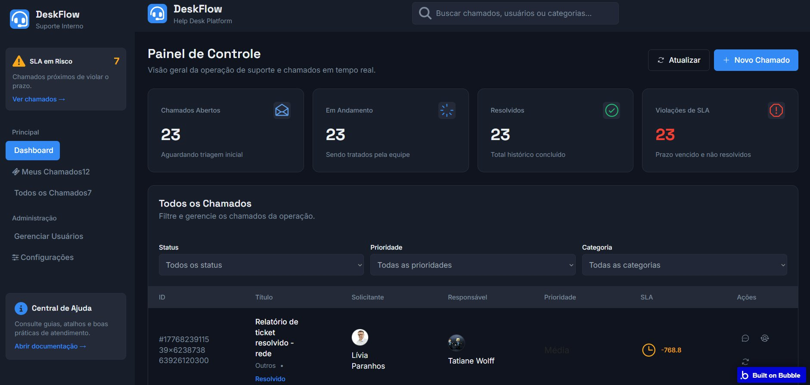

# 🎧 DeskFlow — Help Desk Platform


## 📝 Descrição do Projeto

O **DeskFlow** é uma aplicação web de **Help Desk para suporte interno**, desenvolvida na plataforma **Bubble.io** com auxílio da IA generativa como acelerador de desenvolvimento. O sistema permite o gerenciamento completo de chamados de suporte, com controle de SLA, prioridades, categorias e separação de dados por usuário.

O projeto foi desenvolvido seguindo rigorosamente os fundamentos de **engenharia de software**, aplicando boas práticas de segurança, governança e escalabilidade — demonstrando que a IA gera um "rascunho" e que a atuação humana é indispensável para um produto profissional.

🔗 **App ao vivo:** [https://edisonaugustoal.bubbleapps.io/version-test](https://edisonaugustoal.bubbleapps.io/version-test)

---

## 🖼️ Interface do Sistema



---

## ✨ Funcionalidades

### 📊 Painel de Controle (Dashboard)
- Visão geral da operação de suporte em tempo real
- Cards com métricas principais:
  - **Chamados Abertos** — aguardando triagem inicial
  - **Em Andamento** — sendo tratados pela equipe
  - **Resolvidos** — total histórico concluído
  - **Violações de SLA** — chamados com prazo vencido (alerta em vermelho)
- Alerta lateral de **"SLA em Risco"** com contagem de chamados críticos

### 🎫 Gestão de Chamados
- Listagem completa de todos os chamados com filtros por:
  - **Status** (Aberto, Em Andamento, Resolvido)
  - **Prioridade** (Alta, Média, Baixa)
  - **Categoria**
- Tabela com colunas: ID, Título, Solicitante, Responsável, Prioridade, SLA e Ações
- Criação de novo chamado com botão **"+ Novo Chamado"**
- Barra de busca global por chamados, usuários ou categorias

### 👤 Área do Usuário
- **Meus Chamados** — visão filtrada apenas pelos chamados do usuário logado
- **Todos os Chamados** — visão administrativa com todos os registros

### ⚙️ Administração
- **Gerenciar Usuários** — controle de acesso e perfis
- **Configurações** — parâmetros do sistema

### ❓ Central de Ajuda
- Guias, atalhos e boas práticas de atendimento integrados à sidebar

---

## 🏗️ Arquitetura e Engenharia de Software

### Modelagem de Dados (Data Types)
| Entidade | Descrição |
| :--- | :--- |
| **Usuário** | Dados de autenticação e perfil |
| **Chamado** | Título, descrição, status, prioridade, categoria, SLA |
| **Categoria** | Tipos de chamado (ex: Rede, Hardware, Software) |

### Option Sets (sem hardcode)
| Set | Valores |
| :--- | :--- |
| **Status** | Aberto, Em Andamento, Resolvido |
| **Prioridade** | Alta, Média, Baixa |

### 🔒 Segurança (Privacy by Design)
- Regra de privacidade aplicada: `This Chamado's Creator is Current User`
- Dados de cada usuário são invisíveis para outros usuários logados
- Removida a regra padrão "Publicly visible" gerada pela IA
- Prevenção da vulnerabilidade **OWASP LCNC** de exposição acidental de dados

### ⚡ Otimização de Performance
- Buscas ao banco de dados configuradas apenas no `Repeating Group` (não nas células individuais)
- Controle de consumo de **WUs (Work Units)** do Bubble

### 🗂️ Governança de Workflows
- Workflows organizados por **cores**: Verde (sucesso/navegação) e Vermelho (exclusão)
- **Notes** adicionadas em cada workflow complexo para documentação interna

---

## 🛠️ Tecnologias Utilizadas


---

## 📋 Processo de Desenvolvimento

```
1. Análise crítica do material de referência
       ↓
2. Arquitetura e modelagem de dados (fora do Bubble)
       ↓
3. Geração da base com IA no Bubble (prompt detalhado)
       ↓
4. Refatoração de front-end e lógica (atuação humana)
       ↓
5. Configuração de segurança e privacidade (Privacy by Design)
       ↓
6. Otimização de performance e custos (WUs)
       ↓
7. Governança: cores, pastas e documentação in-platform
```

---

## 🚪 Estratégia de Saída (Anti Vendor Lock-in)

O Bubble retém a posse do código-fonte gerado na plataforma. Para mitigar o risco de **Vendor Lock-in**, a estratégia de saída consiste em:

1. Habilitar a **Data API do Bubble** nas configurações do app
2. Exportar as tabelas (`Usuário`, `Chamado`, `Categoria`) via requisições **JSON**
3. Reescrever o sistema em código tradicional (**React** + **Node.js**) utilizando os dados exportados como base
4. Replicar as regras de privacidade e workflows na nova arquitetura

---

## ✅ Checklist de Entrega

- [x] Link do app funcional (version-test)
- [x] Regras de privacidade configuradas (`Creator is Current User`)
- [x] Option Sets sem hardcode de status e prioridade
- [x] Workflows coloridos e comentados com Notes
- [x] Estratégia de saída documentada

---

Desenvolvido por <a href="https://github.com/AugustoSoul">AugustoSoul</a> — SM6 Engenharia de Software e IA com Bubble.io
