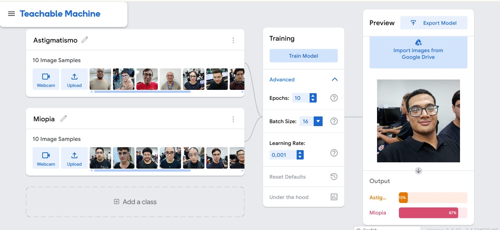

# 🔬 Laboratório de Classificação Visual

## 📝 Descrição do Projeto

Este projeto utiliza o **Google Teachable Machine** para treinar um modelo de classificação de imagens capaz de identificar condições visuais — **Astigmatismo** e **Miopia** — a partir de fotos de rosto. O objetivo é explorar conceitos de aprendizado de máquina, viés algorítmico e a importância da qualidade dos dados de treinamento.

O modelo foi treinado com **10 amostras de imagem por classe**, utilizando os seguintes parâmetros:

| Parâmetro | Valor |
| :--- | :--- |
| Epochs | 10 |
| Batch Size | 16 |
| Learning Rate | 0,001 |

### 🎯 Resultado do Modelo

| Classe | Confiança |
| :--- | :--- |
| Astigmatismo | 13% |
| Miopia | 87% |

## ⚠️ Análise de Viés

### 1. Mecanismo do Viés

O viés no modelo ocorre devido à seleção restrita e não rotulada corretamente dos dados de treinamento. As imagens foram incluídas sem identificação explícita de qual condição cada indivíduo possuía, fazendo com que o algoritmo associasse características aleatórias — como iluminação, posição do rosto e formato dos óculos — em vez de padrões reais entre as classes.

O desequilíbrio no resultado final (13% vs 87%) indica que o modelo internalizou uma distribuição distorcida, gerando previsões que não refletem corretamente a realidade.

### 2. Consequência Social

Sistemas de IA com viés podem classificar incorretamente condições visuais, gerando:
- Frustração emocional e perda de confiança na tecnologia
- Recomendações inadequadas em contextos de saúde ou educação
- Invisibilização de certos grupos
- Decisões equivocadas em contextos profissionais ou médicos

### 3. Ação Mitigadora (Human-in-the-loop)

A abordagem **Human-in-the-loop (HITL)** propõe a participação ativa de especialistas humanos na curadoria dos dados, por meio de:

- ✅ Revisão e rotulagem correta de cada imagem por classe
- ✅ Equilíbrio entre as categorias de treinamento
- ✅ Identificação de inconsistências nos dados
- ✅ Validação manual do dataset antes do treinamento

## 🛠️ Tecnologias Utilizadas

## 📁 Arquivos do Projeto

| Arquivo | Descrição |
| :--- | :--- |
| [TeachaBlemachine_Documento.pdf](./TeachaBlemachine_Documento.pdf) | Análise completa do viés, consequências e mitigação |
| [evidencia-modelo.jpeg](./evidencia-modelo.jpeg) | Print do modelo treinado no Teachable Machine |

## 🖼️ Evidência Visual

## ▶️ Como Reproduzir

1. Acesse [Teachable Machine](https://teachablemachine.withgoogle.com/)
2. Crie um projeto de **Imagem**
3. Adicione as classes: `Astigmatismo` e `Miopia`
4. Faça upload de pelo menos 10 imagens por classe, **devidamente rotuladas**
5. Configure os parâmetros avançados conforme a tabela acima
6. Clique em **Train Model** e avalie os resultados

---
Desenvolvido por <a href="https://github.com/AugustoSoul">AugustoSoul</a>
